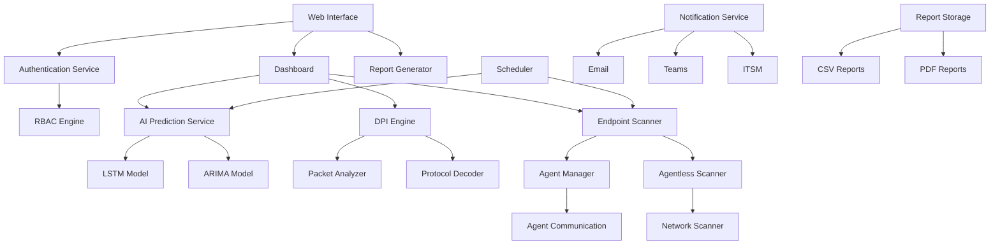
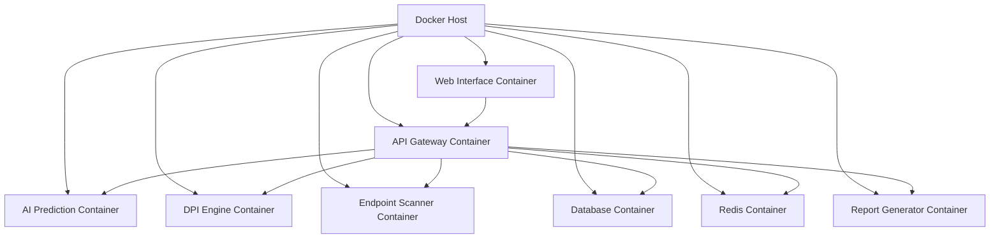

# RansomEye Shield - AI-Powered Ransomware Detection & Response System

## Architecture Overview

### Core Components

## Component Breakdown

### 1. Web Interface Layer
- Modern React-based UI with RBAC support
- Custom branding support
- Real-time dashboard
- Report generation interface
- Scheduler UI

### 2. Authentication & Authorization
- JWT-based authentication
- Role-Based Access Control (RBAC)
- Permission management
- Session management

### 3. AI Prediction Service
- LSTM model for time-series analysis
- ARIMA model for statistical forecasting
- Model training pipeline
- Real-time prediction engine

### 4. Deep Packet Inspection (DPI) Engine
- Packet capture and analysis
- Protocol decoding
- Command & control detection
- Payload inspection

### 5. Endpoint Scanner
- Agent-based scanning
- Agentless scanning
- Network discovery
- System inventory

### 6. Scheduler
- Cron-like scheduling
- Relative time scheduling (Now + X minutes/hours/days)
- AI model training scheduling
- Scan scheduling

### 7. Notification Service
- Email integration
- Microsoft Teams integration
- ITSM tool integration
- Alert management

### 8. Report Generator
- CSV report generation
- PDF report generation
- Custom report templates
- Historical data export

## Data Flow

1. User Authentication & Authorization
   - User logs in through web interface
   - RBAC engine validates permissions
   - Session is established

2. Real-time Monitoring
   - DPI engine captures network traffic
   - Endpoint scanner monitors system state
   - AI models process data in real-time

3. Detection & Response
   - AI models predict potential threats
   - DPI detects command/control traffic
   - Endpoint scanner identifies suspicious behavior
   - Notifications are triggered

4. Reporting & Analysis
   - Data is aggregated and stored
   - Reports are generated in CSV/PDF
   - Historical data is maintained
   - Analytics are performed

## Technology Stack

### Frontend
- React.js with TypeScript
- Material-UI for components
- Chart.js for visualizations
- Socket.IO for real-time updates

### Backend
- Python with FastAPI
- Redis for caching
- PostgreSQL for data storage
- TensorFlow/Keras for AI models

### Infrastructure
- Docker for containerization
- Docker Compose for orchestration
- Nginx for reverse proxy
- SSL/TLS for secure communication

## Deployment Architecture

## Security Features

1. Encryption
   - TLS for all communications
   - Encrypted database storage
   - Secure key management

2. Access Control
   - Multi-factor authentication
   - Role-based permissions
   - Audit logging

3. Data Protection
   - Regular backups
   - Data encryption at rest
   - Secure data transfer

## Offline Mode

- Local database storage
- Offline scanning capabilities
- Local report generation
- Cached AI models
- Synchronization on reconnect

## Integration Points

1. Email Systems
   - SMTP integration
   - Template-based notifications
   - Alert escalation

2. Microsoft Teams
   - Webhook integration
   - Custom message formatting
   - Alert cards

3. ITSM Tools
   - REST API integration
   - Ticket creation
   - Status updates

## Development Guidelines

1. Modular Design
   - Independent microservices
   - Clear API contracts
   - Loose coupling

2. Scalability
   - Horizontal scaling
   - Load balancing
   - Resource optimization

3. Maintainability
   - Clean code practices
   - Comprehensive documentation
   - Automated testing

4. Performance
   - Caching strategies
   - Resource optimization
   - Efficient data processing

## Getting Started

1. Clone the repository
2. Configure environment variables
3. Build Docker containers
4. Start the services
5. Configure RBAC roles
6. Train AI models
7. Set up integrations

## License

This project is proprietary software. All rights reserved.

## Support

For support and assistance, please contact:
- Technical Support: support@ransomeye.com
- Documentation: docs.ransomeye.com
